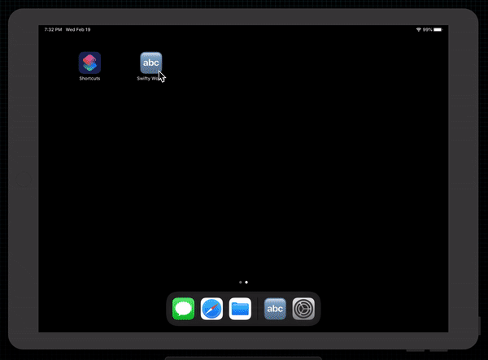

# Swifty Words

  

 
Based on the popular indie game 7 Little Words. Users are going to see a list of hints and buttons with different letters on, they need to use those buttons to enter words matching the hints.

## Examples within this code
- addTarget()
- enumerated()
- joined()
- replacingOccurances()

## Demonstration
Small demonstration as to what the application does when on device.
 

